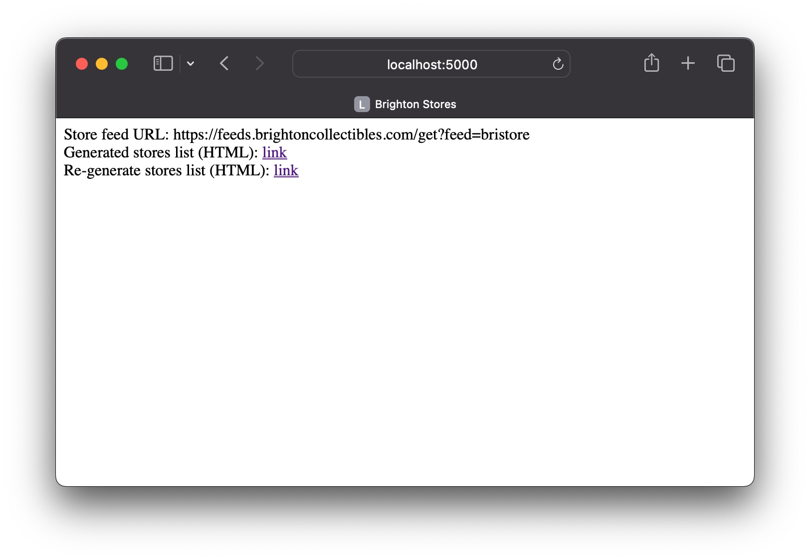

# Brighton Tech Challenge

## Setup instructions
1. Pre-requisites -- [git](https://git-scm.com/downloads), [docker](https://www.docker.com/products/docker-desktop/)
2. Clone repo
    ```shell
       git clone git@github.com:shaktis/brighton.git
       cd brighton
    ```
3. Create a .env file with feel URL.  
    ```shell
       cp .env.example .env
    ```
4. Build and launch the app and tail logs 
    ```shell
       docker compose build --no-cache && docker compose up -d && docker logs -f --tail 10 brighton-app-1 
    ```
5. The application logs will store counts by state as well as create a static HTML file as required by the task 
6. Navigate to http://127.0.0.1:5000 and you should see the home page as shown in the image below. The first link goes to the static HTML file created at server start and the second link will re-download and recreate the static HTML file
   

## Application structure 
### 1-Backend 
The app comprises a python/flask backend with an entry point located in [app.py](brighton/app.py). Lines 29-32 display the store counts by state and create the static HTML file.

`StoreService` in [services.py](brighton/services.py) is a service façade for the backend operations required to complete the task  

### 2-Front-end
[brighton/templates/stores.html](brighton/templates/stores.html) stores the required HTML and CSS for the front-end. It is defined as a Jinja2 template, the templating system used by the `flask` framework.

### 2-Database
The recommended database definition for storing data returned by the feed is provided in [sql/ddl.sql](sql/ddl.sql) 

### 4-Dev Ops
Docker related files are [docker-compose.yml](docker-compose.yml) and [DockerFile](DockerFile) and Kubernetes related config is provided in [k8s/deployment.yml](k8s/deployment.yml)